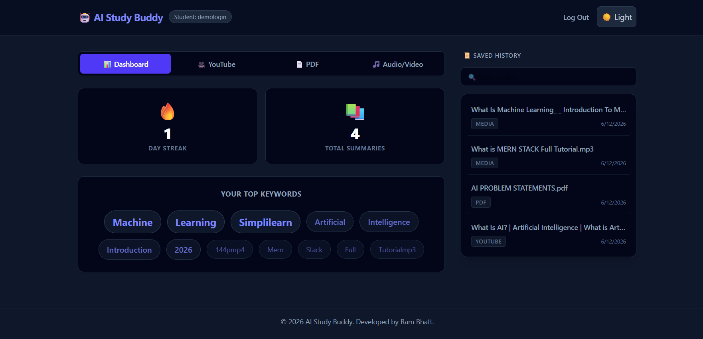

# 🧠 AI-Powered Study Buddy


An AI-powered educational platform that transforms study materials into structured learning resources using Large Language Models (LLMs).

The application accepts multiple learning formats—including **YouTube videos, PDF documents, audio files, and video files**—and automatically generates concise summaries, interactive flashcards, quizzes, downloadable notes, and context-aware AI tutoring.

---

# 📑 Table of Contents

- About the Project
- Features
- Screenshots
- Technology Stack
- Project Structure
- Installation
- Environment Variables
- Security Features
- Future Enhancements
- Author

---

# 📚 About the Project

Students often spend hours reading lengthy documents, watching lectures, and preparing revision notes.

**AI-Powered Study Buddy** simplifies this process by using Artificial Intelligence to automatically convert learning materials into organized study resources.

Simply upload your content, and the platform instantly generates:

- 📄 Structured Notes
- 📝 AI Summaries
- 🧠 Flashcards
- ❓ MCQ Quizzes
- 💬 AI Tutor
- 📥 Word Document Export

The goal is to reduce study time while improving learning efficiency and retention.

---

# ✨ Features

## 🔐 Authentication

- JWT Authentication
- Secure Login & Registration
- Email OTP Verification
- Forgot Password
- Password Reset via Email
- Protected Routes
- User Data Isolation

---

## 📥 Multi-Modal Content Processing

Supported Inputs

- 🎥 YouTube Videos
- 📄 PDF Documents
- 🎵 MP3 Audio
- 🎬 MP4 Videos

The system extracts text from each source before sending it to the AI model.

---

## 🤖 AI Features

### 📝 AI Summarization

Generate clean and structured summaries from:

- YouTube Videos
- PDF Documents
- Audio Files
- Video Files

---

### 💬 AI Tutor

- Ask follow-up questions
- Context-aware responses
- Answers based only on uploaded content

---

### 🧠 Flashcard Generator

Automatically creates revision flashcards for quick learning.

---

### ❓ Quiz Generator

Generate Multiple Choice Questions (MCQs)

Features include:

- Instant Evaluation
- Score Calculation
- Answer Review
- Learning Feedback

---

### 📥 Export Notes

Download generated summaries as Microsoft Word (.docx) documents.

---

## 📊 Analytics Dashboard

Track your study progress through:

- Study Streak
- Total Summaries Generated
- Most Studied Topics
- Learning Activity

---

## 🌙 User Experience

- Modern Dashboard
- Dark Theme
- Responsive Design
- Fast Performance
- Clean User Interface

---

# 📸 Application Screenshots

## 🔐 Authentication

| Login | Signup |
|-------|--------|
|  |  |

| Forgot Password | Reset Password |
|----------------|----------------|
|  |  |

---

## 🏠 Dashboard


---

## 📝 AI Summaries

### YouTube Summary


---

### PDF Summary


---

### Audio Summary


---

### Video Summary


---

## 💬 AI Tutor


---

## 🧠 Flashcards


---

## ❓ Quiz


---

## 📊 Analytics Dashboard



---

# 🛠️ Technology Stack

## Frontend

- React.js
- Vite
- HTML5
- CSS3
- JavaScript

---

## Backend

- Python
- FastAPI
- Uvicorn

---

## Database

- MongoDB Atlas

---

## Artificial Intelligence

- Groq API
- Llama 3.1 8B Instant

---

## Libraries & Tools

- PyPDF
- MoviePy
- youtube-transcript-api
- python-docx
- JWT Authentication
- SMTP (Brevo)

---

# 📂 Project Structure

```text
ai-study-assistant
│
├── backend/
│
├── frontend/
│
├── screenshots/
│   ├── authentication/
│   ├── dashboard/
│   ├── ai-features/
│   ├── flashcards/
│   └── quiz/
│
├── requirements.txt
│
└── README.md
```

---

# 🚀 Installation

## Clone the Repository

```bash
git clone https://github.com/Rambhatt08/ai-study-assistant-production.git
```

---

## Backend Setup

```bash
cd backend

python -m venv venv

venv\Scripts\activate

pip install -r requirements.txt

uvicorn main:app --reload
```

---

## Frontend Setup

```bash
cd frontend

npm install

npm run dev
```

---

# 🔑 Environment Variables

Create a `.env` file in the backend directory.

```env
GROQ_API_KEY=your_api_key

JWT_SECRET_KEY=your_secret_key

MONGODB_URI=your_mongodb_connection_string

SMTP_EMAIL=your_email

SMTP_PASSWORD=your_password
```

---

# 🔒 Security Features

- JWT Authentication
- Password Hashing
- Email Verification
- Password Reset Tokens
- Protected API Routes
- User Data Isolation
- Environment Variables
- Secure MongoDB Connection

---

# 🚀 Future Enhancements

- OCR Support for Images
- Handwritten Notes Recognition
- PPT/PPTX Support
- AI Mind Maps
- Voice-based AI Tutor
- Mobile Application
- Collaborative Study Rooms
- Multi-language Support

---

# 👨‍💻 Author

**Ram Bhatt**


**Skills**

- Python
- FastAPI
- React.js
- Machine Learning
- Artificial Intelligence
- MongoDB

---

## ⭐ If you found this project useful, please consider giving it a Star!
