# 🧠 AI-Powered Study Buddy


An AI-powered educational platform that transforms study materials into structured learning resources using Large Language Models (LLMs).

The application supports multiple input formats—including YouTube videos, PDF documents, audio, and video files—and automatically generates concise summaries, interactive flashcards, quizzes, and context-aware AI tutoring to improve the learning experience.

---

## 📖 Table of Contents

- About the Project
- Features
- Screenshots
- Technology Stack
- System Architecture
- Installation
- Project Structure
- Future Enhancements
- Author

---

# 📚 About the Project

Traditional studying often involves manually reading lengthy documents, taking notes, and creating revision materials.

AI-Powered Study Buddy automates this entire workflow using modern Artificial Intelligence techniques. Users simply upload their learning material, and the platform instantly generates:

- 📄 Well-structured notes
- 🧠 Interactive flashcards
- ❓ Multiple-choice quizzes
- 💬 AI Tutor for follow-up questions
- 📥 Downloadable Word documents

The goal is to reduce study time while improving understanding and retention.

---

# ✨ Features

## 🔐 Authentication

- Secure JWT Authentication
- User Registration
- Email OTP Verification
- Forgot Password
- Password Reset via Email
- Protected Routes
- User-specific Data Isolation

---

## 📥 Multi-Modal Content Processing

Supports multiple learning resources:

- 🎥 YouTube Videos
- 📄 PDF Documents
- 🎵 MP3 Audio
- 🎬 MP4 Videos

The platform extracts text from each source before sending it to the AI engine.

---

## 🤖 AI Features

### 📝 Smart Summarization

Generate concise and structured summaries from:

- YouTube Videos
- PDF Files
- Audio Files
- Video Files

---

### 💬 AI Tutor

- Ask follow-up questions
- Context-aware responses
- Answers based only on uploaded study material

---

### 🧠 Flashcard Generator

Automatically creates study flashcards for quick revision.

---

### ❓ Quiz Generator

Generate multiple-choice quizzes from uploaded content.

Includes:

- Score Calculation
- Answer Review
- Instant Feedback

---

### 📥 Export Notes

Download generated summaries as Microsoft Word (.docx) documents.

---

## 📊 Analytics Dashboard

Track learning progress with:

- Study Streak
- Total Summaries Generated
- Most Studied Topics
- Activity Overview

---

## 🌙 User Experience

- Responsive Design
- Dark Mode
- Modern UI
- Fast Loading
- Clean Dashboard

---

# 📸 Screenshots

## Authentication

| Login | Signup |
|-------|--------|
| 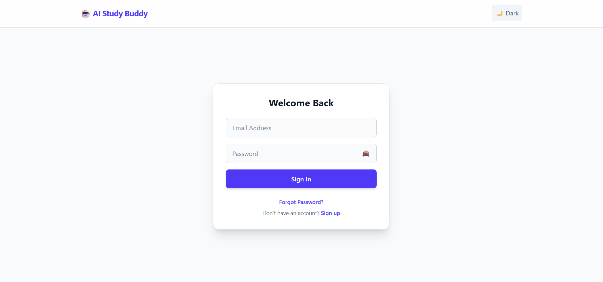 | 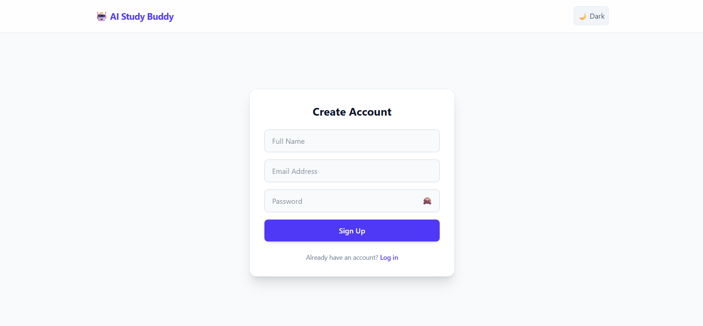 |

| Forgot Password | Reset Password |
|----------------|----------------|
| 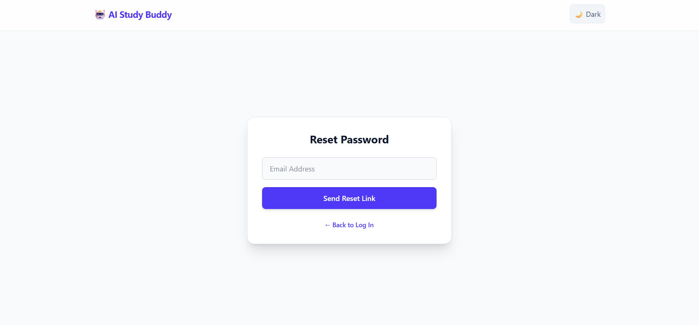 | 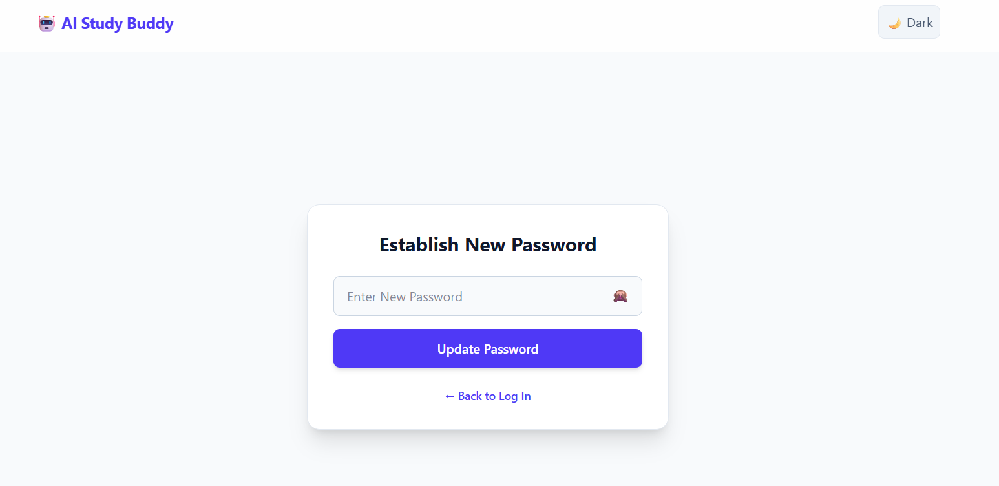 |

---

## Dashboard

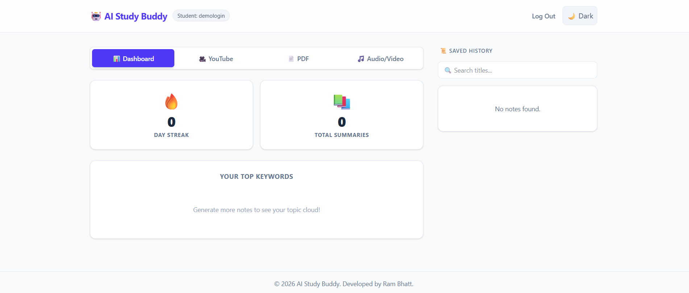

---

## AI Study Generation

### YouTube Summary

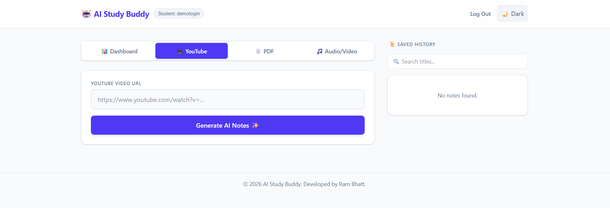

### PDF Summary

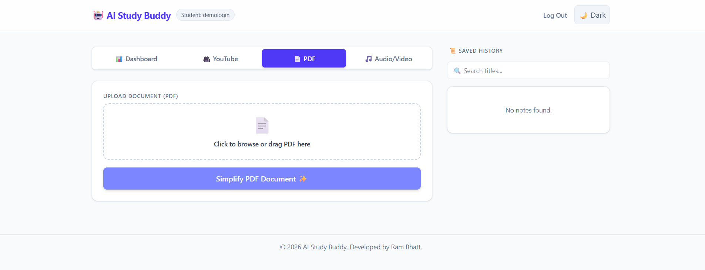

### Audio Summary

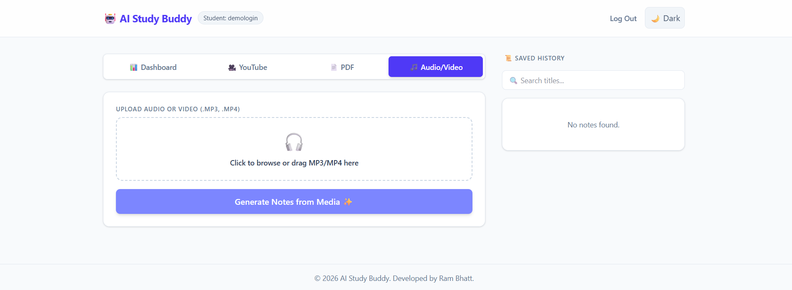

### Video Summary

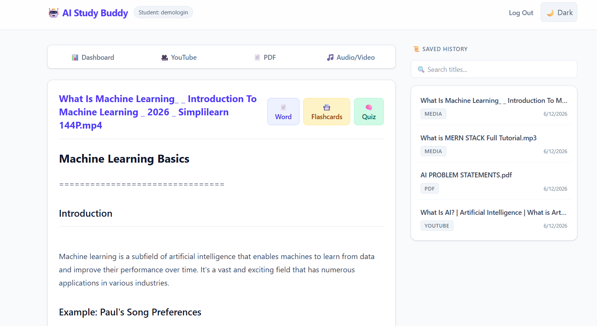

### AI Tutor

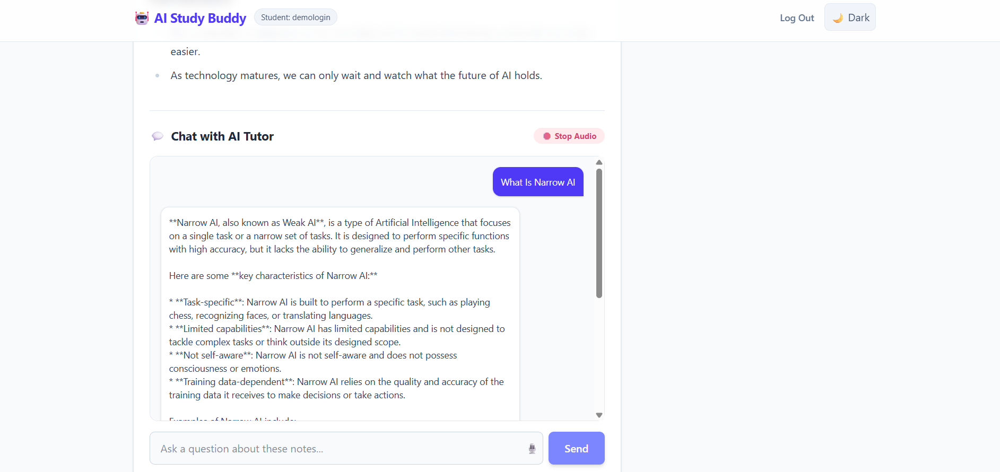

### Flashcards


### Quiz

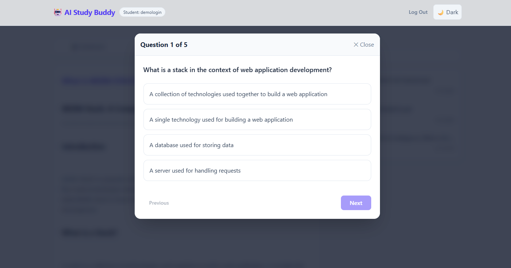

### Analytics


---

# 🏗️ Technology Stack

## Frontend

- React.js
- Vite
- JavaScript
- HTML5
- CSS3

---

## Backend

- Python
- FastAPI
- Uvicorn
- JWT Authentication

---

## Database

- MongoDB Atlas

---

## Artificial Intelligence

- Groq API
- Llama 3.1 8B Instant

---

## Document Processing

- PyPDF
- MoviePy
- youtube-transcript-api
- python-docx

---

## Email Services

- SMTP
- Brevo

---

# ⚙️ Project Structure

```
AI-Study-Buddy
│
├── backend
│
├── frontend
│
├── screenshots
│
├── requirements.txt
│
└── README.md
```

---

# 🚀 Installation

## Clone Repository

```bash
git clone https://github.com/your-username/AI-Study-Buddy.git
```

---

## Backend

```bash
cd backend

python -m venv venv

venv\Scripts\activate

pip install -r requirements.txt

uvicorn main:app --reload
```

---

## Frontend

```bash
cd frontend

npm install

npm run dev
```

---

## Environment Variables

Create a `.env` file.

Example:

```env
GROQ_API_KEY=your_api_key

JWT_SECRET_KEY=your_secret

MONGODB_URI=your_database_url

SMTP_EMAIL=your_email

SMTP_PASSWORD=your_password
```

---

# 🔒 Security Features

- JWT Authentication
- Password Hashing
- Email Verification
- Password Reset Tokens
- User Data Isolation
- Protected API Routes
- Secure Environment Variables

---

# 🚀 Future Enhancements

- OCR for Image Notes
- Handwritten Notes Recognition
- PowerPoint Support
- Collaborative Study Rooms
- AI Mind Maps
- Voice-based AI Tutor
- Mobile Application

---

# 👨‍💻 Author

**Your Name**

Final Year B.E. Computer Engineering Student

Artificial Intelligence • Machine Learning • Full Stack Development

---

## ⭐ If you found this project useful, consider giving it a star!
